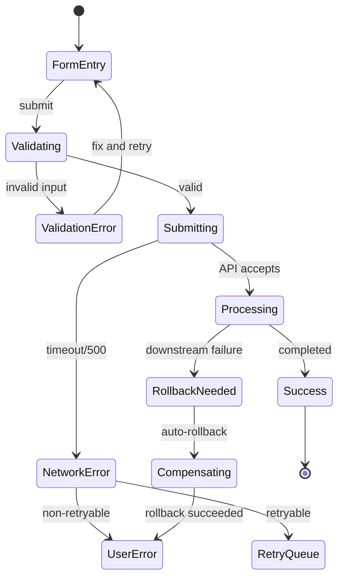

# Flow map

## What I'll do
Produce a complete path map covering every possible system state and transition — happy, failure, timeout, and recovery — before any implementation starts. Every mapped path becomes a test case.

## Inputs I'll use (ask only if missing)
- Feature spec or PRD (or handoff artifact from /prd, /design-doc)
- API endpoints involved
- External dependencies (payment gateways, auth providers, messaging)
- User roles and permissions

## How I'll think about this
1. **Map happy paths first**: Trace the primary user flow from entry to completion. Identify every state the system passes through and every state transition. Name each state explicitly.
2. **Map every input validation failure**: For every user input, enumerate what can be invalid — empty, too long, wrong format, wrong type, negative numbers, special characters, injection attempts. Each produces a distinct error path.
3. **Map every auth/authz failure**: For every operation, what happens when: no token, expired token, valid token but wrong role, valid token but wrong tenant, token for deleted user.
4. **Map every network failure**: For every external call (DB, API, queue, cache), what happens on: timeout, connection refused, 500 error, malformed response, partial response, DNS failure.
5. **Map concurrency conflicts**: Where can two users act on the same resource simultaneously? Optimistic locking failures, double-submit, race conditions on counters or balances.
6. **Map recovery paths**: After each failure, what's the recovery? Retry? Show error? Rollback? Compensating transaction? Dead letter queue? Manual intervention?
7. **Map cleanup inventory**: For every path that allocates resources (DB rows, file uploads, queue messages, external API reservations), trace what must be cleaned up on failure.

## Output format

### State Diagram (Mermaid)


### Path Table
| # | Path | Entry State | Exit State | Trigger | Side Effects | Cleanup Required | Test Case |
|---|------|-------------|-----------|---------|-------------|------------------|-----------|
| 1 | Happy path | FormEntry | Success | Valid submit | DB write, email sent | None | TC-001 |
| 2 | Validation fail | FormEntry | FormEntry | Invalid input | None | None | TC-002 |
| 3 | Network timeout | Submitting | RetryQueue | API timeout | Retry record created | Delete retry on success | TC-003 |
| 4 | Auth expired | Any | Login | Token expired | None | None | TC-004 |
| 5 | Concurrent edit | Processing | ConflictError | Optimistic lock fail | None | None | TC-005 |
| 6 | Downstream fail | Processing | RollbackNeeded | Payment API rejects | Partial DB state | Compensating transaction | TC-006 |

### Cleanup Inventory
| Resource | Allocated When | Released When | Orphan Risk | Cleanup Mechanism |
|----------|---------------|---------------|-------------|-------------------|
| DB row | Step 3 (insert) | Never (permanent) | If step 5 fails | Compensating DELETE |
| File upload | Step 2 (upload) | Step 6 (attach to record) | If step 3-5 fail | Scheduled cleanup job |
| Queue message | Step 4 (publish) | Consumer processes | If consumer crashes | Dead letter queue |

## Anti-patterns to flag
- ⚠️ Only mapping the happy path ("it works when everything goes right")
- ⚠️ "TODO: handle error" in any path — every failure needs an explicit recovery
- ⚠️ Assuming external calls always succeed
- ⚠️ No cleanup for allocated resources on failure paths
- ⚠️ Ignoring concurrency — "users won't do that simultaneously"
- ⚠️ Recovery path is "retry forever" with no circuit breaker

## Quality bar
- ✅ Every external dependency has a failure path mapped
- ✅ Every resource allocation has a corresponding cleanup path
- ✅ Every state has at most one "unhandled" transition (and it's explicitly documented as out of scope)
- ✅ Every path maps to a test case ID
- ✅ Concurrency scenarios identified for all shared mutable state
- ✅ State diagram compiles as valid Mermaid

## Workflow context
- Typically follows: `/design-doc`, `/api-design`, `/user-flow`
- Feeds into: `/spec-to-impl` (paths become test cases), `/test-plan` (coverage matrix)
- Related: `/data-design` (failure handling for data operations)

## Output contract
```yaml
produces:
  - type: flow-map
    format: markdown
    path: "claudedocs/<feature>-flow-map.md"
    sections: [state_diagram, path_table, cleanup_inventory]
    generates_test_cases: true
```
