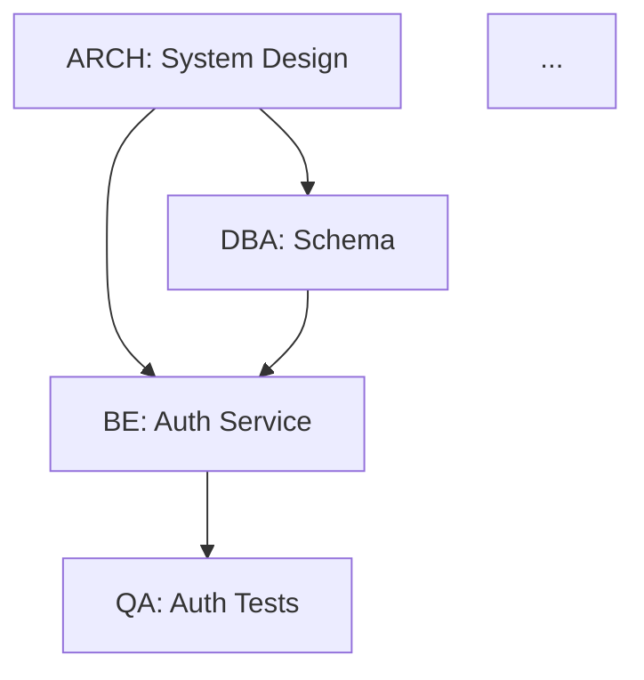

# Spec-to-Impl: 1-to-N Document Specification Skill

Orchestrates a **multi-agent team** to fully implement a specification document — from a single input doc to N output artifacts — with task planning, parallel execution, progress tracking, and status reporting.

---

## 0. Input Handling — Read This First

When invoked as a slash command with arguments:
```
/spec-to-impl $ARGUMENTS
```

**Step 1 — Parse file paths** from `$ARGUMENTS` (space-separated):
```
$ARGUMENTS = "claudedocs/MONEY_REQUEST_PANEL_ANALYSIS.md claudedocs/PAYMENT_LINK_PAGE_PANEL_ANALYSIS.md"
→ files = ["claudedocs/MONEY_REQUEST_PANEL_ANALYSIS.md", "claudedocs/PAYMENT_LINK_PAGE_PANEL_ANALYSIS.md"]
```

**Step 2 — Read each file** using the Read tool sequentially before doing anything else.

**Step 3 — Merge into unified context**: treat multiple files as **complementary spec sections** of the same project. Do NOT implement them as separate independent projects. Identify overlapping entities, shared flows, and integration points across all files.

**Step 4 — Confirm to the user**:
```
📂 Loaded <n> spec file(s):
  ✅ <file1> — <one-line summary>
  ✅ <file2> — <one-line summary>

🔍 Detected: <brief description of what the combined spec covers>
⚠️  Ambiguities: <n> found — will surface before execution

Proceeding to Phase 1: PARSE...
```

**Step 5 — Proceed** to the Quick Decision Tree below.

> If a file path is not found or unreadable, report it clearly and ask the user to confirm the path before continuing.

---

## 0.1 Quick Decision Tree

```
Input received?
  ├─ $ARGUMENTS with file paths
  │     └─ → Section 0: Read files → merge → PARSE → PLAN → EXECUTE
  ├─ Spec doc / PRD / BRD / API contract / user story set (pasted inline)
  │     └─ → Run Phase 1: PARSE → Phase 2: PLAN → Phase 3: EXECUTE
  ├─ "status" / "report" / "what's done?"
  │     └─ → Run: STATUS REPORT (Section 5)
  └─ "assign X to Y" / "re-plan" / "add task"
        └─ → Run: PLAN MUTATION (Section 6)
```

---

## 1. Agent Roster

Before planning, instantiate the relevant agents from this roster. Not every spec needs all agents — select based on what the spec covers.

| Agent ID | Role | Triggers |
|---|---|---|
| `ARCH` | Senior Architect | Any spec with system/service design, DB schema, integration points |
| `BE` | Backend Engineer | APIs, business logic, services, data models, integrations |
| `FE` | Frontend Engineer (React) | React UI components, pages, state management, API wiring |
| `FLUTTER` | Flutter Engineer | Flutter/Dart mobile UI, widgets, Riverpod/BLoC state, platform channels |
| `RN` | React Native Engineer | React Native mobile UI, navigation, native modules |
| `ANDROID` | Android Engineer | Kotlin/Compose UI, ViewModel, Room, Hilt DI |
| `ANGULARJS` | AngularJS Engineer | AngularJS 1.x components, services, directives (legacy) |
| `QA` | QA Engineer | Test plans, unit/integration/e2e test cases, test data |
| `DBA` | Database Architect | Schema design (Postgres, Mongo, Elastic), migrations, query optimization |
| `DEVOPS` | DevOps/Infra Engineer | CI/CD, Docker, K8s, Terraform, deployment configs |
| `SEC` | Security Reviewer | Auth flows, threat model, OWASP checklist |
| `TECH_WRITER` | Technical Writer | API docs, README, OpenAPI spec, ADRs |

**Always include `ARCH` as the orchestrating lead.**

---

## 2. Phase 1 — PARSE the Spec

**Goal**: Extract all implementable units from the input document.

**Instructions for ARCH agent:**

1. Read the entire spec document thoroughly.
2. Extract and categorize into:
   - **Functional Requirements** (FR-001, FR-002…)
   - **Non-Functional Requirements** (NFR-001…)
   - **Entities / Data Models**
   - **API Endpoints / Contracts**
   - **UI Screens / Components** (if applicable)
   - **Integration Points** (external services, webhooks, queues)
   - **Business Rules / Validations**
   - **Test Scenarios** (explicit or implied)
3. Flag any **ambiguities** (mark as `[AMBIGUOUS]`) that need clarification before implementation.
4. Output a structured **Spec Manifest** (see `references/spec-manifest-template.md`).

### 2.1 Runability Check

**Before any planning begins**, verify the project can actually build and run. This prevents planning tasks against a broken foundation.

```bash
# ── Does the project exist? ──────────────────────────────────────────────────
ls -la                              # confirm we're in the right directory
git status                          # confirm it's a git repo

# ── Can it build? ────────────────────────────────────────────────────────────
# Java / Maven
mvn clean compile -q 2>&1 | tail -5
# Java / Gradle
./gradlew compileJava 2>&1 | tail -5
# Node / npm
npm install && npm run build 2>&1 | tail -5

# ── Can it start? ────────────────────────────────────────────────────────────
# Bring up with Docker Compose (detached)
docker compose up -d 2>&1
sleep 10   # wait for services to stabilise

# Check health
curl -sf http://localhost:8080/actuator/health | jq .status
curl -sf http://localhost:3000 -o /dev/null -w "%{http_code}"

# Check DB migration ran cleanly
docker compose exec db psql -U $DB_USER -d $DB_NAME -c "\dt" 2>&1 | head -20

# ── Bring it back down ───────────────────────────────────────────────────────
docker compose down
```

**Runability Report:**
```
🏗️  RUNABILITY CHECK
  Build:      ✅ PASS  (mvn compile — 0 errors)
  Startup:    ✅ PASS  (docker compose up — all containers healthy)
  API health: ✅ UP    (GET /actuator/health → {"status":"UP"})
  Frontend:   ✅ UP    (http://localhost:3000 → 200)
  DB migrate: ✅ PASS  (12 tables found)
  (or)
  Build:      ❌ FAIL  — <error output>
```

> ⛔ If build or startup **FAILS** — halt. Do not proceed to PLAN. Report the error and ask the user to fix the build before continuing. It is pointless to plan implementation on a broken base.

**Output format:**
```
SPEC MANIFEST
=============
Source: <doc name>
Parsed: <timestamp>
Total Requirements: <n>
Ambiguities Found: <n>

FR: <list>
NFR: <list>
Entities: <list>
APIs: <list>
UI: <list>
Integrations: <list>
Rules: <list>
Test Scenarios: <list>
```

> ⚠️ If ambiguities > 3 critical items, PAUSE and surface them to the user before proceeding to Phase 2.

---

## 3. Phase 2 — PLAN & Assign Tasks

**Goal**: Decompose the Spec Manifest into a Task Board and assign agents.

### 3.1 Task Structure

Each task follows this schema:
```
TASK-<ID>
  title:       <short name>
  agent:       <ARCH | BE | FE | QA | DBA | DEVOPS | SEC | TECH_WRITER>
  type:        <design | implement | test | document | review>
  priority:    <P0 | P1 | P2>
  depends_on:  [TASK-IDs] or []
  input:       <what this task consumes>
  output:      <artifact(s) this task produces>
  status:      TODO
  est_effort:  <XS | S | M | L | XL>
  notes:       <optional>
```

### 3.2 Planning Rules

- **P0** = Blocking (must complete before anything else)
- **P1** = Core deliverable
- **P2** = Nice-to-have / post-MVP
- Tasks with no `depends_on` can run **in parallel**
- `ARCH` always owns at minimum: system design, component breakdown, and final integration review
- `QA` tasks always depend on the `BE`/`FE` task they test
- `TECH_WRITER` tasks depend on the API/service tasks being complete

### 3.3 E2E Test Plan — Mandatory Planning Artifact

**The QA agent must produce `e2e/test-plan.yaml` in Wave 1 alongside the ARCH system design.** This is not an afterthought — test cases are planned from the spec before a single line of implementation is written.

**Why in Wave 1:**
- Forces QA to reason about acceptance criteria upfront
- Gives BE/FE agents a concrete definition of done (if my code passes these test cases, I'm done)
- Means `verify-impl` can execute immediately after implementation with no test discovery delay

**QA agent instructions for test plan generation (Wave 1 task):**

```
Input:  Spec Manifest (all FRs, APIs, entities, business rules)
Output: e2e/test-plan.yaml

For every FR:
  1. Write at minimum: 1 happy-path TC + 1 validation TC + 1 auth TC
  2. For P0 FRs: add edge case TCs covering boundary values and error states
  3. For each TC: populate all three layers (api + db + ui) where applicable
     - API-only specs: populate api layer only
     - Headless services: skip ui layer
     - Read-only flows: skip db write checks
  4. Define variable capture chains (TC-001 creates resource → TC-002 reads it)
  5. Include setup/teardown SQL for test isolation

Coverage requirement:
  - Every P0 FR: ≥ 3 test cases
  - Every P1 FR: ≥ 1 test case
  - Every API endpoint: ≥ 1 happy path + 1 error case
  - Every DB table written to: ≥ 1 existence check + 1 field value check
```

**Test plan is referenced in every implementation task:**
```
TASK-002 (BE: Auth Service)
  definition_of_done: All TC-001, TC-002, TC-003 must pass via verify-impl
```

**Seed the test plan into `e2e/test-plan.yaml` at the start of Wave 1** so it exists on disk before any implementation agent starts. Implementation agents can read it to understand what "done" looks like for their task.

See `references/test-plan-schema.md` (in verify-impl skill) for the full YAML schema.

### 3.3 Dependency Graph

After creating tasks, ARCH must produce a **dependency graph** in ASCII or Mermaid:



### 3.4 Parallel Execution Waves

Group tasks into **execution waves** — tasks in the same wave run concurrently:

```
WAVE 1 (parallel): TASK-001, TASK-003
WAVE 2 (parallel): TASK-002, TASK-004, TASK-006
WAVE 3 (parallel): TASK-005, TASK-007
WAVE 4:            TASK-008 (integration), TASK-009 (docs)
```

---

## 4. Phase 3 — EXECUTE

**Goal**: Dispatch sub-agents to execute their tasks, wave by wave — each in an **isolated Git worktree** to prevent branch conflicts during parallel execution.

### 4.0 Worktree Setup (Run Once Before Wave 1)

Before dispatching any agent, ARCH sets up the worktree environment:

```bash
# 1. Ensure you're on the main integration branch
git checkout main   # or master / develop — whatever the base branch is

# 2. Create a worktree per agent that will run in parallel this wave
#    Pattern: .worktrees/<agent-id>-<task-id>
git worktree add .worktrees/be-task-002   feature/be-task-002
git worktree add .worktrees/dba-task-003  feature/dba-task-003
git worktree add .worktrees/fe-task-004   feature/fe-task-004

# 3. List active worktrees to confirm
git worktree list
```

**Naming convention:**
```
Branch:   feature/<agent-id>-<task-id>         e.g. feature/be-task-002
Worktree: .worktrees/<agent-id>-<task-id>/     e.g. .worktrees/be-task-002/
```

**Rules:**
- One worktree per parallel agent — never share a worktree between two concurrent agents
- ARCH always works on `main` / integration branch directly
- Sequential tasks (next wave) can reuse a worktree from the prior wave after it's been merged and pruned
- Add `.worktrees/` to `.gitignore` if not already present

**Track worktree state in the task board** (add `Worktree` column):
```
╔══════════╦══════════════════╦════════╦════════╦═════════════════════════╗
║ TASK-ID  ║ Title            ║ Agent  ║ Status ║ Worktree / Branch       ║
╠══════════╬══════════════════╬════════╬════════╬═════════════════════════╣
║ TASK-002 ║ Auth Service     ║ BE     ║ 🔄 WIP  ║ .worktrees/be-task-002  ║
║ TASK-003 ║ DB Schema        ║ DBA    ║ 🔄 WIP  ║ .worktrees/dba-task-003 ║
║ TASK-004 ║ Login UI         ║ FE     ║ ⏳ Wait ║ (not yet created)       ║
╚══════════╩══════════════════╩════════╩════════╩═════════════════════════╝
```

### 4.1 Agent Dispatch Protocol

For each agent, include in their prompt:
1. Their **agent persona** (from `agents/<role>.md`)
2. The **relevant spec sections** (not the full doc unless needed)
3. Their **specific task(s)** with inputs and expected outputs
4. **Tech stack context** (language, framework, conventions)
5. **Cross-agent contracts** they must conform to (e.g., shared DTOs, API response format)
6. Their **worktree path** — all file writes must go into this directory

**Minimal dispatch template:**
```
You are a <ROLE> working on <PROJECT NAME>.

WORKTREE: .worktrees/<agent-id>-<task-id>/
BRANCH:   feature/<agent-id>-<task-id>
All files you create or modify MUST be written inside this worktree path.
Do NOT write to the main project directory.

TECH STACK: <stack>
CONVENTIONS: <coding conventions or link to conventions file>

YOUR TASK(S):
<paste TASK block(s) assigned to this agent>

CONTRACTS TO RESPECT:
<shared interfaces, API contracts, DB schema already defined by ARCH>

SPEC CONTEXT:
<relevant spec sections only>

PRODUCE:
<list of expected output artifacts with file paths relative to worktree root>

When done:
  git -C .worktrees/<agent-id>-<task-id> add -A
  git -C .worktrees/<agent-id>-<task-id> commit -m "feat(<scope>): <summary> [TASK-<ID>]"

⛔ YOU ARE NOT DONE UNTIL YOU HAVE:
  1. Written the implementation
  2. Written tests covering it
  3. Actually EXECUTED the tests and shown the output
  4. Confirmed all tests PASS (zero failures, zero errors)

Do NOT mark your task complete or commit without a real test run output.
If tests fail, fix the implementation and re-run. Do not skip.

FORMAT: Also output each file as:
--- FILE: <path> ---
<content>
---

At the end of your output, include a TEST REPORT block:
--- TEST REPORT ---
Command: <exact command run>
Working dir: .worktrees/<agent-id>-<task-id>
Output:
<actual stdout/stderr from running tests>
Result: PASSED <n> / FAILED <f> / ERRORS <e>
---
```

### 4.2 Execution Tracking

Maintain a live **Task Board** throughout execution. A task is **NOT** `✅ Done` until tests have been run and passed:

```
TASK BOARD — <Project Name>
Updated: <timestamp>
Progress: <X/Y tasks complete> (<Z%>)

╔══════════╦══════════════════════════╦════════╦═══════════════╦═══════════════╦══════════╗
║ TASK-ID  ║ Title                    ║ Agent  ║ Impl Status   ║ Test Status   ║ Output   ║
╠══════════╬══════════════════════════╬════════╬═══════════════╬═══════════════╬══════════╣
║ TASK-001 ║ System Design            ║ ARCH   ║ ✅ Done       ║ N/A           ║ arch.md  ║
║ TASK-002 ║ Auth Service             ║ BE     ║ ✅ Done       ║ ✅ 24/24 pass ║ auth/    ║
║ TASK-003 ║ DB Schema                ║ DBA    ║ ✅ Done       ║ ✅ 8/8 pass   ║ 001.sql  ║
║ TASK-004 ║ Login UI                 ║ FE     ║ 🔄 WIP        ║ ⏳ Not run    ║ -        ║
║ TASK-005 ║ Auth Unit Tests          ║ QA     ║ ⏳ Waiting    ║ ⏳ Waiting    ║ -        ║
║ TASK-006 ║ Payment Service          ║ BE     ║ ✅ Done       ║ ❌ 3 FAILING  ║ pay/     ║
╚══════════╩══════════════════════════╩════════╩═══════════════╩═══════════════╩══════════╝

Impl:  ✅ Done | 🔄 WIP | ⏳ Waiting | ❌ Blocked
Tests: ✅ n/n pass | ❌ n FAILING | ⚠️ n ERRORS | ⏳ Not run | 🚫 No tests written | N/A
```

> **Hard rule**: A task with `❌ FAILING` or `🚫 No tests written` in the Test Status column blocks the next wave. Do NOT advance until it is resolved.

### 4.3 Test Gates — Wave Advancement Rules

**Before advancing from one wave to the next, ALL of the following must be true:**

```
WAVE GATE CHECK (evidence required)
====================================
[ ] All tasks in wave marked Impl ✅ Done
[ ] All tasks have tests written (no 🚫 No tests written)
[ ] All tasks: Test runner output captured in --- TEST REPORT --- block
    ⛔ "Tests should pass" without output = automatic gate FAIL
[ ] All tasks: Build log shows zero errors (actual output, not claim)
[ ] All tasks: No compilation warnings on new code
[ ] Zero failing tests (no ❌ in Test Status)
[ ] ARCH has reviewed outputs for contract compliance
[ ] Evidence artifacts saved to .spec-to-impl/evidence/wave-N/
```

If any check fails → **HALT**. Do not start the next wave. Surface the failure to the user with:
```
⛔ WAVE <N> GATE FAILED
Cannot advance to Wave <N+1>.

Failing tasks:
  • TASK-006 — Payment Service (BE): 3 tests failing
    Failures: [list test names]
    Root cause: <brief analysis>
    Fix required: <what needs to change>

Awaiting resolution before continuing.
```

### 4.3.1 Agent Retry Protocol

When an agent fails (tests failing, build errors, incomplete output):

```
ATTEMPT 1: Re-dispatch with specific feedback from the failure
  → Include exact error messages, failing test names, stack traces
  → Agent fixes the specific issue and re-runs tests

ATTEMPT 2: Re-dispatch with simplified scope
  → Split the task if it's too large
  → Provide explicit examples of expected output
  → Include patterns from existing codebase as reference

ATTEMPT 3: Re-dispatch with maximum guidance
  → Include a skeleton/template of the expected file structure
  → Provide working examples from other parts of the codebase
  → Narrow the scope to the minimum viable output

If all 3 attempts fail → ESCALATE (choose one):
  ├─ REASSIGN — different agent type takes over (e.g., ARCH assists BE)
  ├─ DECOMPOSE — split into 2-3 smaller tasks dispatched sequentially
  ├─ REVISE — modify the spec requirement (surface to user for input)
  └─ DEFER — mark as P2, document as follow-up, continue with remaining tasks
```

Track attempt count in the task board:
```
║ TASK-006 ║ Payment Service ║ BE ║ ❌ Attempt 2/3 ║ ❌ 3 FAILING ║ .worktrees/be-006 ║
```

> Never retry more than 3 times. Never loop without new information between attempts.
> After 3 failures, the ESCALATE decision must be made — no silent retrying.

**Per-agent test commands by stack:**

| Agent | Stack | Command |
|---|---|---|
| BE | Java / Maven | `mvn test -pl <module> 2>&1` |
| BE | Java / Gradle | `./gradlew test 2>&1` |
| FE (React) | Vitest | `npx vitest run 2>&1` |
| FE (React) | Jest | `npx jest --ci 2>&1` |
| FE (AngularJS) | Karma | `npx karma start --single-run 2>&1` |
| FLUTTER | Dart | `flutter test --coverage 2>&1` |
| RN | Jest | `npx jest --ci 2>&1` |
| ANDROID | Gradle | `./gradlew testDebugUnitTest 2>&1` |
| DBA | Flyway/Liquibase | `./gradlew flywayValidate 2>&1` |
| QA | Playwright | `npx playwright test 2>&1` |
| QA | Cypress | `npx cypress run 2>&1` |
| DEVOPS | Docker | `docker build . 2>&1 && docker compose config 2>&1` |

All commands run from the agent's worktree root: `cd .worktrees/<agent-id>-<task-id> && <command>`

### 4.4 Output Manifest

As artifacts are produced, log them:

```
OUTPUT MANIFEST
===============
TASK-001 → /docs/architecture.md          ✅
TASK-002 → /src/auth/AuthService.java      ✅
TASK-003 → /db/migrations/001_init.sql    ✅
TASK-004 → /src/ui/LoginPage.tsx          🔄
...
```

---

## 5. Status Reporting

**Triggered by**: user asking "status", "progress update", "what's done", "report", or on a periodic cadence.

### On-Demand Status Report Format:

```
═══════════════════════════════════════════════
  PROJECT STATUS REPORT — <Project Name>
  <Timestamp> | Sprint: <N> | Wave: <N>/<N>
═══════════════════════════════════════════════

📊 OVERALL PROGRESS
  Total Tasks:    <n>
  Completed:      <n> (<%)
  In Progress:    <n>
  Blocked:        <n>
  Remaining:      <n>

🧪 TEST HEALTH
  Tests Run:      <n>
  Passing:        <n> ✅
  Failing:        <n> ❌  ← if >0, wave is BLOCKED
  Not Yet Run:    <n> ⏳
  No Tests:       <n> 🚫  ← flag to user if any P0/P1 tasks

🟢 COMPLETED (since last report)
  • TASK-001 — System Design (ARCH) → architecture.md
  • TASK-003 — DB Schema (DBA) → 001_init.sql  [tests: 8/8 ✅]

🔄 IN PROGRESS
  • TASK-002 — Auth Service (BE) — impl done, tests running
  • TASK-004 — Login UI (FE) — started

❌ BLOCKERS
  • TASK-006 — Payment Integration (BE)
    Test failures: PaymentServiceTest.should_refund_when_payment_fails (3 failing)
    OR
    Blocked by: Missing API credentials for Stripe (needs user input)

📋 NEXT UP (next wave)
  • TASK-005 — Auth Unit Tests (QA)
  • TASK-007 — API Docs (TECH_WRITER)

🗂️ ARTIFACTS PRODUCED
  <list output files created so far>

⚠️ DECISIONS NEEDED
  <list any ambiguities or user inputs required>
═══════════════════════════════════════════════
```

### Periodic Reporting
- Default: report after each **wave** completes
- If user requests: "report every N tasks" — track and honor that cadence
- Always report immediately when a **blocker** is found

---

## 6. Plan Mutations

Handle these mid-execution requests gracefully:

| User Request | Action |
|---|---|
| "Add task: X" | Create TASK-N+1, assign agent, insert into dependency graph, update waves |
| "Re-assign TASK-X to Y" | Update agent, re-prompt Y with full context |
| "Mark TASK-X done" | Update status, unblock dependents, advance wave |
| "Skip TASK-X" | Mark SKIP, check if dependents need re-routing |
| "Reprioritize X to P0" | Move to earliest valid wave respecting dependencies |
| "Show only BE tasks" | Filter task board by agent |
| "What depends on TASK-X?" | Traverse dependency graph forward |

---

## 7. Integration & Handoff Review

After all waves complete, ARCH runs a **final integration review** — including merging all agent branches.

### 7.0 Worktree Merge & Cleanup

Before reviewing, merge all agent branches into main:

```bash
git checkout main

# Merge each agent branch (no fast-forward — preserves history per agent)
git merge --no-ff feature/be-task-002   -m "merge: BE auth service [TASK-002]"
git merge --no-ff feature/dba-task-003  -m "merge: DBA schema [TASK-003]"
git merge --no-ff feature/fe-task-004   -m "merge: FE login page [TASK-004]"
# ... repeat for all agent branches

# Resolve any merge conflicts — ARCH mediates by referencing shared contracts

# Remove worktrees and delete branches after successful merge
git worktree remove .worktrees/be-task-002
git worktree remove .worktrees/dba-task-003
git worktree remove .worktrees/fe-task-004
git worktree prune

git branch -d feature/be-task-002
git branch -d feature/dba-task-003
git branch -d feature/fe-task-004
```

**Merge conflict resolution rules:**
- Conflicts in **shared contracts** (DTOs, interfaces) → ARCH decides, updates contract, notifies affected agents
- Conflicts in **independent files** (different services) → should not occur; if they do, check for naming collisions
- Conflicts in **config files** (pom.xml, package.json) → merge both dependency sets manually
- After resolving: re-run tests before proceeding to integration checks

### 7.1 Integration Checks

1. **Contract Compliance** — Do all BE APIs match the contracts FE consumes?
2. **Schema Alignment** — Do data models match across services?
3. **Test Coverage** — Are all P0/P1 FRs covered by at least one test?
4. **Missing Artifacts** — Any spec requirement without a corresponding output?
5. **Cross-Cutting Concerns** — Auth, logging, error handling consistently applied?
6. **Duplicate Detection** — Scan for patterns that duplicate existing codebase code:
   ```bash
   # Check for duplicate controller/service/repository patterns
   # Compare new classes against existing base classes and abstractions
   # Flag any new utility/helper that reimplements existing functionality
   ```
   For each duplicate found:
   ```
   ⚠️ DUPLICATE DETECTED
     New:      src/payment/PaymentResponseEnvelope.java
     Existing: src/common/ApiResponse.java
     Action:   Replace PaymentResponseEnvelope with ApiResponse<PaymentDto>
   ```
   Fix all duplicates before proceeding.
7. **Live Verification** — Invoke the `verify-impl` skill to run API, DB, and UI checks against the running system:

```
/verify-impl --api --db --ui
```

> Do NOT consider integration review complete until `verify-impl` returns ✅ READY TO MERGE.
> Any ❌ failures from `verify-impl` are treated as integration blockers — same weight as a failing unit test.

Output an **Integration Report** with:
- ✅ Passed checks
- ⚠️ Warnings (non-blocking gaps)
- ❌ Failures (must fix before done)
- 🔄 Duplicates found and resolved

### 7.2 Cleanup & Finalization

After integration review passes:

**1. GIT CHECKPOINT**
```bash
git tag "pre-merge-spec-to-impl-$(date +%Y%m%d-%H%M%S)"
```

**2. WORKTREE CLEANUP**
```bash
git worktree list                    # verify all merged
git worktree prune                   # remove stale entries
rm -rf .worktrees/                   # remove directory
# Delete merged feature branches
git branch --merged main | grep feature/ | xargs -r git branch -d
```

**3. TEMP FILE CLEANUP**
```bash
rm -rf .spec-to-impl/evidence/      # clear evidence artifacts
rm -f e2e/.captures.json            # ephemeral test data
find . -name "*.orig" -name "*.bak" -delete 2>/dev/null
```

**4. HANDOFF ARTIFACT**
Write a handoff artifact for downstream skills:
```yaml
# claudedocs/handoff-spec-to-impl-<timestamp>.yaml
source_skill: "spec-to-impl"
artifacts:
  - path: "e2e/test-plan.yaml"
    type: "test-plan"
  - path: "<list all produced source files>"
    type: "code"
quality_assessment: "All waves passed, integration review clean"
suggested_next:
  - skill: "verify-impl"
    context: "e2e/test-plan.yaml has N test cases ready"
  - skill: "finalize"
    context: "Implementation complete, ready for commit and PR"
```

**5. SUGGEST NEXT STEP**
```
✅ Implementation complete. All waves passed, integration review clean.
   Git checkpoint: pre-merge-spec-to-impl-<timestamp>
   Worktrees: cleaned
   Temp files: cleaned

   Next steps:
   → Run /verify-impl for live verification
   → Run /finalize to lint, test, commit, and create PR
   → Run /evidence-review for final quality gate (optional)
```

---

## 8. Tech Stack Inference

If the user does not specify a tech stack, infer from the spec context, detect from project files, or ask. Default assumptions:

| Layer | Default | Alternatives |
|---|---|---|
| Backend | Java 21 + Spring Boot 3.x | — |
| Frontend (Web) | React 18 + TypeScript + Tailwind | AngularJS (1.x legacy) |
| Frontend (Mobile) | Flutter 3.x + Dart | React Native + TypeScript, Android (Kotlin) |
| Database (Relational) | PostgreSQL | — |
| Database (Document) | MongoDB (if document store needed) | — |
| Search | Elasticsearch | Typesense |
| Auth | JWT / OAuth2 | — |
| Containerization | Docker + Docker Compose | — |
| Orchestration | Kubernetes | — |
| IaC | Terraform | — |
| Messaging | Kafka (if async flows present) | — |
| BE Testing | JUnit 5 + Mockito + AssertJ | — |
| FE Testing (Web) | Vitest + React Testing Library | Karma + Jasmine (AngularJS) |
| FE Testing (Mobile) | Flutter: widget + integration tests | RN: Jest + RNTL, Android: JUnit + MockK |
| E2E Testing | Playwright (Chromium) | Detox (React Native), Espresso (Android) |
| API Style | REST (OpenAPI 3.x) | — |
| Migrations (SQL) | Liquibase | — |
| Migrations (Mongo) | mongosh scripts | — |

**Auto-detection from project files:**
```bash
# Detect stack from project markers
[ -f "pubspec.yaml" ]       && echo "Flutter detected"
[ -f "build.gradle" ]       && echo "Android/Gradle detected"
[ -f "pom.xml" ]            && echo "Java/Maven detected"
[ -f "package.json" ]       && echo "Node/React/RN detected"
[ -f "angular.json" ]       && echo "Angular detected"
[ -f "bower.json" ]         && echo "AngularJS detected"
[ -f "docker-compose.yml" ] && echo "Docker Compose detected"
[ -d "terraform" ]          && echo "Terraform detected"
```

> Always confirm stack with user before dispatching execution agents.

---

## 9. Claude API Best Practices for Sub-Agent Dispatch

When dispatching sub-agents via the Anthropic API:

```javascript
// Parallel wave execution
const waveResults = await Promise.all(
  wave.map(task => callAgent({
    model: "claude-sonnet-4-20250514",
    max_tokens: 8192,
    system: agentPersona(task.agent),
    messages: [{ role: "user", content: buildTaskPrompt(task, contracts, specContext) }]
  }))
);
```

- Use `claude-sonnet-4-20250514` for all sub-agents (balance of quality + speed)
- Pass **only relevant spec sections** per agent (not the full doc) — reduce token waste
- Include **shared contracts** (DTOs, API schema) in every agent's context
- Collect outputs and feed as inputs to dependent tasks in next wave
- Set `max_tokens: 8192` for code-heavy tasks; `4096` for design/doc tasks

---

## 10. Reference Files

| File | When to Read |
|---|---|
| `agents/arch.md` | Dispatching the ARCH agent |
| `agents/be.md` | Dispatching the BE agent |
| `agents/fe.md` | Dispatching the FE agent |
| `agents/qa.md` | Dispatching the QA agent |
| `agents/dba.md` | Dispatching the DBA agent |
| `agents/devops.md` | Dispatching the DEVOPS agent |
| `references/spec-manifest-template.md` | Phase 1 output structure |
| `references/task-schema.md` | Full task schema with all fields |
| `references/conventions.md` | Default coding conventions |
| `templates/dispatch-prompt.md` | Agent dispatch prompt template |

---

## 11. Failure Handling

| Failure Type | Recovery |
|---|---|
| Agent produces incomplete output | Re-dispatch with more targeted prompt + examples into same worktree |
| Contract mismatch between agents | ARCH mediates, issues updated contract, re-dispatches affected agents |
| Ambiguous spec section | Surface to user, pause dependent tasks, document assumption if user unavailable |
| Token limit hit | Split task into sub-tasks, dispatch sequentially in same worktree |
| Circular dependency detected | ARCH resolves by identifying the interface boundary and extracting a shared contract task |
| Merge conflict on shared file | ARCH resolves using shared contracts as source of truth; commits resolution on main |
| Worktree in dirty state | Run `git -C .worktrees/<id> status` to inspect; stash or reset before re-dispatch |
| Worktree branch diverged from main | `git -C .worktrees/<id> rebase main` to bring it current before merging |
