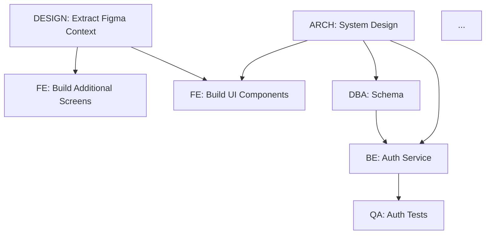

# Spec-to-Impl: 1-to-N Document Specification Skill

Orchestrates a **multi-agent team** to fully implement a specification document — from a single input doc to N output artifacts — with task planning, parallel execution, progress tracking, and status reporting.

---

## 0. Input Handling — Read This First

When invoked as a slash command with arguments:
```
/spec-to-impl $ARGUMENTS
```

### Step 0 — Discover upstream handoff manifests

**Before reading any files**, check for handoff manifests from upstream skills:

```bash
# Find all handoff manifests, most recent first
ls -t claudedocs/handoff-*.yaml 2>/dev/null | head -10
```

For each manifest found:
1. Read the YAML and check if `suggested_next[].skill` includes `"spec-to-impl"`
2. If yes, read the `context` field for guidance from the upstream skill
3. Read all files listed in `suggested_next[].reads[]` — these are the artifacts you should consume
4. Record the manifest path — add it to `consumed_from[]` in your own handoff manifest later
5. Check `quality.status` — if `"blocked"`, stop and report the blockers to the user

**Report what was discovered:**
```
📋 UPSTREAM ARTIFACTS DISCOVERED
  Handoff manifests found: <n>
  Artifacts for spec-to-impl:
    ✅ claudedocs/payment-links-prd.md (from /prd)
    ✅ design/DESIGN.md (from /ui-design)
    ✅ design/components/component-tree.md (from /ui-design)
    ✅ design/components/testid-registry.md (from /ui-design)
    ✅ claudedocs/payment-links-flow-map.md (from /flow-map)
  Context from upstream:
    /prd: "3 new API endpoints, payment link CRUD + expiry"
    /ui-design: "6 components, 44 testIDs, 3 screens"
```

> If handoff manifests have `quality.status: "partial"`, consume artifacts with `status: "ready"` and skip those with `status: "in-progress"`.

### Step 1 — Parse file paths from arguments

```
$ARGUMENTS = "claudedocs/MONEY_REQUEST_PANEL_ANALYSIS.md claudedocs/PAYMENT_LINK_PAGE_PANEL_ANALYSIS.md"
-> files = ["claudedocs/MONEY_REQUEST_PANEL_ANALYSIS.md", "claudedocs/PAYMENT_LINK_PAGE_PANEL_ANALYSIS.md"]
```

Combine with any files discovered from handoff manifests in Step 0.

### Step 2 — Read each file

Read using the Read tool sequentially before doing anything else.

### Step 3 — Merge into unified context

Treat multiple files as **complementary spec sections** of the same project. Do NOT implement them as separate independent projects. Identify overlapping entities, shared flows, and integration points across all files — including upstream handoff artifacts.

### Step 4 — Confirm to the user

```
Loaded <n> spec file(s):
  <file1> -- <one-line summary>
  <file2> -- <one-line summary>

Upstream artifacts consumed: <n> (from <skills>)
Detected: <brief description of what the combined spec covers>
Ambiguities: <n> found -- will surface before execution

Proceeding to Phase 1: PARSE...
```

### Step 5 — Proceed to the Quick Decision Tree below.

> If a file path is not found or unreadable, report it clearly and ask the user to confirm the path before continuing.

---

## 0.1 Quick Decision Tree

```
Input received?
  |-- (always) Check handoff manifests first (Step 0)
  |
  |-- $ARGUMENTS with file paths
  |     --> Step 0 + Steps 1-5 -> PARSE -> PLAN -> EXECUTE
  |-- No args but handoff manifests found
  |     --> Consume upstream artifacts -> PARSE -> PLAN -> EXECUTE
  |-- Spec doc / PRD / BRD / API contract / user story set (pasted inline)
  |     --> Run Phase 1: PARSE -> Phase 2: PLAN -> Phase 3: EXECUTE
  |-- "status" / "report" / "what's done?"
  |     --> Run: STATUS REPORT (Section 5)
  +-- "assign X to Y" / "re-plan" / "add task"
        --> Run: PLAN MUTATION (Section 6)
```

---

## 1. Agent Roster

Before planning, instantiate the relevant agents from this roster. Not every spec needs all agents — select based on what the spec covers.

| Agent ID | Role | Triggers |
|---|---|---|
| `ARCH` | Senior Architect | Any spec with system/service design, DB schema, integration points |
| `DESIGN` | UI/UX Design Engineer | Any spec with UI screens AND a Figma URL or selection is provided |
| `BE` | Backend Engineer | APIs, business logic, services, data models, integrations |
| `FE` | Frontend Engineer (React) | React UI components, pages, state management, API wiring |
| `FLUTTER` | Flutter Engineer | Flutter/Dart mobile UI, widgets, Riverpod/BLoC state, platform channels |
| `RN` | React Native Engineer | React Native mobile UI, navigation, native modules |
| `ANDROID` | Android Engineer | Kotlin/Compose UI, ViewModel, Room, Hilt DI |
| `ANGULARJS` | AngularJS Engineer | AngularJS 1.x components, services, directives (legacy) |
| `QA` | QA Engineer | Test plans, unit/integration/e2e test cases, test data |
| `DBA` | Database Architect | Schema design (Postgres, Mongo, Elastic), migrations, query optimization |
| `DEVOPS` | DevOps/Infra Engineer | CI/CD, Docker, K8s, Terraform, deployment configs |
| `SEC` | Security Reviewer | Auth flows, threat model, OWASP checklist |
| `OBS` | Observability Engineer | Structured logging, distributed tracing, metrics, dashboards, alerting |
| `TECH_WRITER` | Technical Writer | API docs, README, OpenAPI spec, ADRs |

**Always include `ARCH` as the orchestrating lead.**
**Always include `OBS` when the spec involves any backend service or API.**
**Include `DESIGN` agent whenever a Figma source is provided alongside UI requirements.** DESIGN always completes before FE tasks begin — it is a hard dependency for all UI implementation.

### 1.1 Agent Model Routing

Route agents to the right model for cost-efficiency without sacrificing quality:

| Agent | Model | Rationale |
|---|---|---|
| `ARCH` | `opus` (default) | Deepest reasoning for architecture decisions |
| `DESIGN` | `opus` | Design system extraction + component mapping requires deep reasoning |
| `BE`, `FE`, `FLUTTER`, `RN`, `ANDROID` | `sonnet` | Best coding model, optimal for implementation |
| `QA` | `sonnet` | Complex test reasoning + code generation |
| `DBA` | `opus` | Schema design + migration safety requires deep reasoning |
| `OBS` | `sonnet` | Contract definition + instrumentation code |
| `DEVOPS` | `sonnet` | Infrastructure-as-code generation |
| `SEC` | `opus` | Security analysis and threat modeling requires deepest reasoning |
| `TECH_WRITER` | `haiku` | Documentation generation, high-volume low-complexity |
| `ANGULARJS` | `sonnet` | Legacy code requires careful reasoning |

### 1.2 Agent Teams Mode (Experimental)

For complex specs where agents need to communicate directly (e.g., BE and FE negotiating API contracts in real-time), enable Agent Teams:
- Set `CLAUDE_CODE_EXPERIMENTAL_AGENT_TEAMS=1`
- Agents become full sessions with shared task lists and mailboxes
- Use when agents need to challenge each other's decisions, not just report back
- Higher token cost but better coordination for tightly-coupled specs

Default: subagent mode (agents report back to ARCH lead). Use Agent Teams for specs with 5+ interacting agents.

---

## 1.5 Phase 0 — DESIGN CONTEXT EXTRACTION (Figma MCP)

*(Only runs when a Figma source is present)*

**Trigger conditions:**
- User provides a Figma file or frame URL anywhere in their message
- User says "use my current Figma selection"
- User says "the designs are in Figma: [link]"
- Spec document itself contains a Figma file ID or URL

**DESIGN Agent step-by-step protocol:**

**Step 1 — CONNECT:** Verify Figma MCP is connected by checking available MCP tools for "figma". If not connected, pause immediately and show the user this setup command: `claude plugin install figma@claude-plugins-official`. Do not proceed until connected.

**Step 2 — INVENTORY:** List all frames and screens in the Figma file that are relevant to the spec being implemented. Output:
- List of screen names with frame links and node IDs
- List of component names with node IDs
- List of any design libraries or component sets referenced

**Step 3 — EXTRACT:** For each screen and component in scope, extract:
- Color tokens and Figma variables → map to CSS custom property names
- Typography styles → font-size, font-weight, line-height, letter-spacing
- Spacing system → all gap, padding, margin values used
- Component variant properties and their allowed values
- Auto-layout rules → map to CSS flexbox/grid equivalents
- Interactive states present in Figma variants: hover, focus, active, disabled, error, loading, empty
- Responsive breakpoints → identify mobile, tablet, desktop frames
- Asset references → icons, images, illustrations

**Step 4 — PRODUCE Design Context Package** in this exact format:

```
DESIGN CONTEXT PACKAGE
======================
Source: <Figma file name>
Extracted: <timestamp>
Screens covered: <n>
Components catalogued: <n>

━━━ DESIGN TOKENS ━━━━━━━━━━━━━━━━━━━━━━━━

COLORS (Figma variable → CSS custom property):
  --color-brand-primary:     #<hex>
  --color-brand-secondary:   #<hex>
  --color-surface-default:   #<hex>
  --color-surface-elevated:  #<hex>
  --color-text-primary:      #<hex>
  --color-text-muted:        #<hex>
  --color-border-default:    #<hex>
  --color-border-strong:     #<hex>
  [all additional extracted color variables]

SPACING:
  --spacing-xs: 4px
  --spacing-sm: 8px
  --spacing-md: 16px
  --spacing-lg: 24px
  --spacing-xl: 40px

TYPOGRAPHY:
  --font-display:  <size>/<line-height> weight-<value>
  --font-heading:  <size>/<line-height> weight-<value>
  --font-body:     <size>/<line-height> weight-<value>
  --font-caption:  <size>/<line-height> weight-<value>

BORDER RADIUS:
  --radius-sm: 4px | --radius-md: 8px | --radius-lg: 12px | --radius-xl: 16px

━━━ COMPONENTS ━━━━━━━━━━━━━━━━━━━━━━━━━━━

<ComponentName>:
  Figma node:      <node-id>
  Figma link:      <direct component link>
  Variants:        [<prop>: <value1> | <value2> | ...]
  Props:           { <propName>: <type>, ... }
  States:          [default, hover, focus, disabled, error, loading, empty]
  Code Connect:    <mapped → use <ImportName> | unmapped → generate from scratch>
  Layout:          <flex-row | flex-col | grid-cols-<n>>
  Gap:             <value>
  Padding:         <top> <right> <bottom> <left>
  Dimensions:      <w x h | hug | fill>
  Notes:           <design decisions, edge cases, or ambiguities>

[repeat for each component in scope]

━━━ SCREENS ━━━━━━━━━━━━━━━━━━━━━━━━━━━━━

<ScreenName>:
  Figma frame:     <frame-link>
  Suggested route: <route path e.g. /dashboard>
  Layout:          <describe overall grid/flex structure>
  Components used: [<ComponentName>, ...]
  Breakpoints:     [mobile 375px, tablet 768px, desktop 1440px]
  Data implied:    [<what API data this screen needs to render>]

[repeat for each screen in scope]

━━━ AMBIGUITIES ━━━━━━━━━━━━━━━━━━━━━━━━━

[DESIGN-AMB-001]
  Component/Screen: <name>
  Issue:            <what is unclear>
  Options:          <possible interpretations>
  Blocking:         yes / no

[repeat for each ambiguity]

━━━ TAILWIND CONFIG ADDITIONS ━━━━━━━━━━━

theme: {
  extend: {
    colors: { [extracted color tokens as CSS var references] },
    spacing: { [extracted spacing tokens] },
    borderRadius: { [extracted radius tokens] },
    fontSize: { [extracted typography tokens] },
  }
}
```

**Rule:** If DESIGN agent finds more than 3 critical blocking ambiguities, PAUSE and surface them to the user before dispatching the FE agent.

See `agents/design.md` for the full DESIGN agent persona and extraction protocol.

---

## 2. Phase 1 — PARSE the Spec

**Goal**: Extract all implementable units from the input document.

**Instructions for ARCH agent:**

1. Read the entire spec document thoroughly.
2. Extract and categorize into:
   - **Functional Requirements** (FR-001, FR-002...)
   - **Non-Functional Requirements** (NFR-001...)
   - **Entities / Data Models**
   - **API Endpoints / Contracts** (style: REST/GraphQL/gRPC/async — detect from spec or codebase)
   - **UI Screens / Components** (if applicable)
   - **Integration Points** (external services, webhooks, queues)
   - **Business Rules / Validations**
   - **Test Scenarios** (explicit or implied)
   - **Observability Requirements** (logging events, metrics to track, SLOs, dashboard needs)
   - **Design Pattern Candidates** (patterns matched to requirements — repository, strategy, factory, observer, circuit breaker, outbox, CQRS)
   - **API Style & Standards** (REST/GraphQL/gRPC/async — detect from codebase or spec; document versioning, pagination, error format decisions)
3. Flag any **ambiguities** (mark as `[AMBIGUOUS]`) that need clarification before implementation.
4. Output a structured **Spec Manifest** (see `references/spec-manifest-template.md`).

### 2.1 Runability Check

**Before any planning begins**, verify the project can actually build and run. This prevents planning tasks against a broken foundation.

```bash
# -- Does the project exist? --
ls -la                              # confirm we're in the right directory
git status                          # confirm it's a git repo

# -- Can it build? --
# Java / Maven
mvn clean compile -q 2>&1 | tail -5
# Java / Gradle
./gradlew compileJava 2>&1 | tail -5
# Node / npm
npm install && npm run build 2>&1 | tail -5

# -- Can it start? --
# Bring up with Docker Compose (detached)
docker compose up -d 2>&1
sleep 10   # wait for services to stabilise

# Check health
curl -sf http://localhost:8080/actuator/health | jq .status
curl -sf http://localhost:3000 -o /dev/null -w "%{http_code}"

# Check DB migration ran cleanly
docker compose exec db psql -U $DB_USER -d $DB_NAME -c "\dt" 2>&1 | head -20

# -- Bring it back down --
docker compose down
```

**Runability Report:**
```
RUNABILITY CHECK
  Build:      PASS  (mvn compile -- 0 errors)
  Startup:    PASS  (docker compose up -- all containers healthy)
  API health: UP    (GET /actuator/health -> {"status":"UP"})
  Frontend:   UP    (http://localhost:3000 -> 200)
  DB migrate: PASS  (12 tables found)
  (or)
  Build:      FAIL  -- <error output>
```

> If build or startup **FAILS** — halt. Do not proceed to PLAN. Report the error and ask the user to fix the build before continuing. It is pointless to plan implementation on a broken base.

**Output format:**
```
SPEC MANIFEST
=============
Source: <doc name>
Parsed: <timestamp>
Total Requirements: <n>
Ambiguities Found: <n>

FR: <list>
NFR: <list>
Entities: <list>
APIs: <list>
UI: <list>
Integrations: <list>
Rules: <list>
Test Scenarios: <list>
Observability: <list>
Design Patterns: <list>
API Style: <REST | GraphQL | gRPC | Async> — <versioning strategy, error format>
```

> If ambiguities > 3 critical items, PAUSE and surface them to the user before proceeding to Phase 2.

---

## 3. Phase 2 — PLAN & Assign Tasks

**Goal**: Decompose the Spec Manifest into a Task Board and assign agents.

### 3.1 Task Structure

Each task follows this schema:
```
TASK-<ID>
  title:       <short name>
  agent:       <ARCH | BE | FE | QA | DBA | DEVOPS | OBS | SEC | TECH_WRITER>
  type:        <design | implement | test | instrument | document | review>
  priority:    <P0 | P1 | P2>
  depends_on:  [TASK-IDs] or []
  input:       <what this task consumes>
  output:      <artifact(s) this task produces>
  status:      TODO
  est_effort:  <XS | S | M | L | XL>
  patterns:    [<design patterns this task must apply>]
  observability: [<logging events, metrics, traces this task must emit>]
  figma_ref:   <Figma frame link or node-id — required for all FE tasks when design source present>
  notes:       <optional>
```

### 3.2 Planning Rules

- **P0** = Blocking (must complete before anything else)
- **P1** = Core deliverable
- **P2** = Nice-to-have / post-MVP
- Tasks with no `depends_on` can run **in parallel**
- `ARCH` always owns at minimum: system design, component breakdown, shared contracts, and final integration review
- `QA` tasks always depend on the `BE`/`FE` task they test
- `OBS` produces the observability contract in Wave 1 — every implementation agent references it
- `ARCH` produces the API standards contract in Wave 1 — defines style, envelope, errors, pagination, versioning
- Every `BE` task MUST include: structured logging, trace context propagation, and business metrics as acceptance criteria
- Every `BE` task MUST conform to the API standards contract: correct HTTP methods/status codes, response envelope, error format, pagination, idempotency
- Every service endpoint MUST emit: request count, error count, and latency histogram (RED metrics)
- `FE` agents MUST reference `/ui-design` outputs when available: wireframes, component specs, design tokens, accessibility requirements, testIDs
- If `/ui-design` was NOT run but the spec has UI screens, suggest running it first or extract minimal component specs in Wave 1
- `DESIGN` agent always completes before any `FE` task begins when a Figma source is present
- All FE tasks that have a `figma_ref` field must list `TASK-000` (DESIGN) in their `depends_on`
- When user updates the Figma source mid-execution, re-run Phase 0 and re-dispatch only the affected FE tasks
- `TECH_WRITER` must produce OpenAPI/AsyncAPI/proto spec that matches the implemented API
- `TECH_WRITER` tasks depend on the API/service tasks being complete

### 3.3 E2E Test Plan — Mandatory Planning Artifact

**The QA agent must produce `e2e/test-plan.yaml` in Wave 1 alongside the ARCH system design.** This is not an afterthought — test cases are planned from the spec before a single line of implementation is written.

**Why in Wave 1:**
- Forces QA to reason about acceptance criteria upfront
- Gives BE/FE agents a concrete definition of done (if my code passes these test cases, I'm done)
- Means `verify-impl` can execute immediately after implementation with no test discovery delay

**QA agent instructions for test plan generation (Wave 1 task):**

```
Input:  Spec Manifest (all FRs, APIs, entities, business rules)
Output: e2e/test-plan.yaml

For every FR:
  1. Write at minimum: 1 happy-path TC + 1 validation TC + 1 auth TC
  2. For P0 FRs: add edge case TCs covering boundary values and error states
  3. For each TC: populate all three layers (api + db + ui) where applicable
     - API-only specs: populate api layer only
     - Headless services: skip ui layer
     - Read-only flows: skip db write checks
  4. Define variable capture chains (TC-001 creates resource -> TC-002 reads it)
  5. Include setup/teardown SQL for test isolation

Coverage requirement:
  - Every P0 FR: >= 3 test cases
  - Every P1 FR: >= 1 test case
  - Every API endpoint: >= 1 happy path + 1 error case
  - Every DB table written to: >= 1 existence check + 1 field value check
```

**Test plan is referenced in every implementation task:**
```
TASK-002 (BE: Auth Service)
  definition_of_done: All TC-001, TC-002, TC-003 must pass via verify-impl
```

**Seed the test plan into `e2e/test-plan.yaml` at the start of Wave 1** so it exists on disk before any implementation agent starts. Implementation agents can read it to understand what "done" looks like for their task.

See `references/test-plan-schema.md` (in verify-impl skill) for the full YAML schema.

### 3.4 Dependency Graph

After creating tasks, ARCH must produce a **dependency graph** in ASCII or Mermaid:



> `TASK-000` is only present when a Figma source is provided. All FE tasks depend on it.

### 3.5 Parallel Execution Waves

Group tasks into **execution waves** — tasks in the same wave run concurrently:

```
WAVE 0 (pre-check): Detect design artifacts:
  A. From /ui-design:
    - Check: claudedocs/handoff-ui-design-*.yaml (handoff artifact)
    - Check: claudedocs/handoff-ui-design-*.yaml → stitch.project_id (if present, FE agents can call get_screen() for live data)
    - Check: design/DESIGN.md (portable design system -- from Stitch or manual)
    - Check: design/stitch-screens/*.md (Stitch screen structure -- FE agents use as reference)
    - Check: design/wireframes/*.png (visual references from Figma)
    - Check: design/components/testid-registry.md (testIDs for E2E)
  B. From Figma MCP (if Figma URL or selection provided):
    - TASK-000 — DESIGN: Extract Figma Context (Phase 0)
    - [BLOCKS all FE tasks until complete]
    - Produces: Design Context Package (tokens, components, screens, ambiguities)
  C. If NO design artifacts and NO Figma source and spec has UI screens:
    - Suggest running /ui-design first (with --stitch for speed) or /figma-to-code if designs exist in Figma
WAVE 1 (parallel): ARCH: System Design + API Standards + Patterns, OBS: Observability Contract, QA: Test Plan, DBA: Schema
WAVE 2 (parallel): BE: Services (against API contract), FE: Components (against UI design), DEVOPS: Docker/CI
WAVE 3 (parallel): QA: Tests, SEC: Review, OBS: Verify Instrumentation
WAVE 4:            ARCH: Integration Review (API + OBS + UI compliance), TECH_WRITER: Docs + OpenAPI spec
```

### 3.6 API Standards Contract — Mandatory Wave 1 Artifact

**ARCH must define the API standards contract in Wave 1** before any BE agent writes an endpoint. This prevents inconsistency across agents implementing different services in parallel.

See `references/api-standards.md` for the full standard. ARCH selects and documents:

1. **API Style**: REST (OpenAPI 3.1) / GraphQL / gRPC / Async (Kafka/AMQP) — based on spec signals and existing codebase
2. **Response Envelope**: Standardized wrapper for all responses (data + meta + errors)
3. **Error Format**: RFC 9457 Problem Details (REST), UserError payload (GraphQL), gRPC Status with details
4. **Pagination**: Cursor-based or offset-based with standard parameters and response metadata
5. **Versioning**: URL path (`/api/v1/`) or header — with sunset policy
6. **Idempotency**: Idempotency-Key header on POST/state-changing operations
7. **Rate Limiting**: Headers (Limit, Remaining, Reset) and tiers
8. **Naming Convention**: Resource naming, URL structure, query parameter format
9. **Security**: Auth per endpoint, CORS, security headers
10. **Documentation**: OpenAPI/AsyncAPI/proto spec — machine-readable, with examples

```
API STANDARDS CONTRACT
======================
Style:        REST (OpenAPI 3.1)
Versioning:   URL path (/api/v1/)
Envelope:     { "data": T, "meta": { requestId, timestamp, traceId } }
Errors:       RFC 9457 Problem Details with field-level errors array
Pagination:   Cursor-based (limit + after/before) for public, offset for admin
Idempotency:  Idempotency-Key header on all POST endpoints
Rate Limit:   100 req/min public, 1000 req/min authenticated
Naming:       /api/v1/{resource-plural}[/{id}] — nouns, plural, kebab-case
Auth:         Bearer JWT — 401 missing, 403 insufficient
Dates:        ISO 8601 UTC always
Money:        { amount: "150.00", currency: "USD" } — string, never float
IDs:          UUID v7 — never expose auto-increment
```

Every BE agent receives this contract as input and MUST implement against it. API compliance is checked in the wave gate and integration review.

### 3.7 Design Pattern Selection — Mandatory Planning Step

ARCH must select and document design patterns for each major component before implementation begins. Pattern selection is driven by requirements, not preference.

```
PATTERN SELECTION
=================
For each component, document:
  Component:            <name>
  Requirement Driver:   FR-XXX / NFR-XXX
  Selected Pattern:     <pattern name>
  Justification:        <why this pattern fits>
  Alternatives Rejected: <what else was considered>

Common pattern applications:
  - Repository Pattern      -> data access (all stores)
  - Strategy Pattern         -> pluggable algorithms (payment providers, notification channels)
  - Factory Method           -> object creation with varying types
  - Observer / Domain Events -> cross-module communication (Spring ApplicationEventPublisher)
  - Circuit Breaker          -> external service calls (Resilience4j)
  - Outbox Pattern           -> reliable event publishing with DB transactions
  - CQRS                     -> read-heavy queries with separate models (only when justified)
  - Builder                  -> complex object construction (test data, configuration)
```

Anti-patterns to flag and prevent:
- God class / service doing everything -> split by Single Responsibility
- Anemic domain model -> push behavior into domain objects where it belongs
- Service locator -> use constructor injection exclusively
- Premature abstraction -> extract only when 2+ implementations exist or pattern is proven

### 3.8 Observability Contract — Mandatory Wave 1 Artifact

**The OBS agent must produce the observability contract in Wave 1.** This defines instrumentation requirements that every implementation agent must follow — same weight as API contracts.

See `references/observability-contract.md` for the full standard. Key points enforced:

1. **Structured Logging**: JSON format, required fields (traceId, spanId, service, userId, tenantId, operationName), log levels with strict semantics
2. **Distributed Tracing**: OpenTelemetry with W3C Trace Context, required spans at every boundary
3. **Metrics**: RED method (Rate, Errors, Duration) auto-instrumented + custom business metrics via Micrometer
4. **Health & Readiness**: Spring Boot Actuator endpoints with custom health indicators
5. **Dashboard Spec**: Every feature produces a dashboard definition (request rate, error rate, latency percentiles, business KPIs)

Implementation agents reference this contract the same way they reference API contracts — it is a shared interface, not optional.

### 3.9 Feedback Loop Design

Feedback is not just between waves — it is continuous and structured:

```
FEEDBACK LOOPS
==============
1. SELF-REVIEW (each agent, before commit):
   - API standards compliance (correct methods, status codes, envelope, error format, pagination)
   - Contracts compliance (DTOs, shared interfaces, observability)
   - Design pattern adherence
   - Test coverage targets met
   - No code duplication with existing codebase

2. CROSS-AGENT REVIEW (after wave completes, before gate):
   Dispatch a review agent (subagent_type: "bmad-review") to check:
   - BE <-> FE: API integration correctness (endpoints, payloads, error handling, pagination)
   - BE <-> API contract: response envelope, status codes, error format, idempotency
   - OBS verifies: all agents emitted required logs, metrics, traces
   - QA verifies: implementation matches test expectations
   - FE <-> UI design: components match wireframes, accessibility, responsive behavior

3. WAVE GATE (Section 4.3): full test execution + evidence

4. SPEC DRIFT CHECK (every 2 waves):
   ARCH re-reads original spec and verifies:
   - Building what was asked (no silent FR drops)
   - No scope creep beyond spec
   - NFRs still achievable with current implementation
```

---

## 4. Phase 3 — EXECUTE

**Goal**: Dispatch sub-agents to execute their tasks, wave by wave — each in an **isolated Git worktree** for branch-safe parallel execution.

### 4.0 Worktree Isolation via Claude Code Agent Tool

Use Claude Code's native **worktree isolation** for each agent dispatch. This automatically creates an isolated copy of the repository per agent — no manual `git worktree add` needed.

```
# Dispatch pattern using Claude Code Agent tool:
Agent(
  subagent_type: "code",           # or appropriate agent type
  model: "sonnet",                 # route per Section 1.1
  isolation: "worktree",           # automatic worktree per agent
  prompt: <dispatch prompt from templates/dispatch-prompt.md>
)
```

**Parallel dispatch** — launch all independent agents in a single message:
```
# Wave 2 example: BE, FE, DEVOPS run in parallel
# Send a single message with 3 Agent tool calls, all with isolation: "worktree"
Agent(subagent_type: "code", model: "sonnet", isolation: "worktree", prompt: <BE task>)
Agent(subagent_type: "code", model: "sonnet", isolation: "worktree", prompt: <FE task>)
Agent(subagent_type: "code", model: "sonnet", isolation: "worktree", prompt: <DEVOPS task>)
```

**Background dispatch** for non-blocking agents:
```
Agent(
  subagent_type: "technical-writer",
  model: "haiku",
  isolation: "worktree",
  run_in_background: true,          # don't block on docs
  prompt: <TECH_WRITER task>
)
```

**Worktree results**: When an agent makes changes, the result includes the worktree path and branch name. Track these in the task board for merge.

**Rules:**
- One worktree per parallel agent — automatic via `isolation: "worktree"`
- ARCH works on main/integration branch directly (no worktree isolation)
- Add `.worktrees/` to `.gitignore` if not already present
- After merge, worktrees with no changes are auto-cleaned

### Worktree Isolation for Parallel Agents

When multiple implementation agents (BE, FE, DBA, etc.) need to write code simultaneously:
- Each agent runs with `isolation: "worktree"` to get an independent copy of the repository
- This prevents file conflicts when agents edit overlapping areas
- Worktrees are auto-cleaned if the agent makes no changes
- Results are merged via individual PRs or a combined branch

Use worktree isolation when:
- 3+ agents need to write code in parallel
- Agents may touch the same configuration files (package.json, pom.xml, etc.)
- The spec involves both backend and frontend changes in the same repo

### Background Agent Execution

Low-priority agents (TECH_WRITER, OBS) can run in background while critical-path agents execute:
- Launch TECH_WRITER with `run_in_background: true` — documentation can be generated while code is being written
- Launch OBS with `run_in_background: true` after BE completes — observability instrumentation doesn't block FE work
- You'll be notified when background agents complete

### 4.1 Agent Dispatch Protocol

For each agent, construct a prompt using `templates/dispatch-prompt.md` that includes:
1. Their **agent persona** (from `agents/<role>.md`)
2. The **relevant spec sections** (not the full doc unless needed)
3. Their **specific task(s)** with inputs and expected outputs
4. **Tech stack context** (language, framework, conventions)
5. **Cross-agent contracts** they must conform to (shared DTOs, interfaces)
6. **API standards contract** they must implement against (style, envelope, errors, pagination, versioning)
7. **Observability contract** they must instrument against (from OBS Wave 1 output)
8. **Design patterns** they must apply (from ARCH pattern selection)
9. **UI design artifacts** (for FE agents — wireframes, component specs, design tokens from `/ui-design`)
10. **Test plan reference** — which test cases define "done" for their task

**Minimal dispatch template:**
```
You are a <ROLE> working on <PROJECT NAME>.

TECH STACK: <stack>
CONVENTIONS: <coding conventions or link to conventions file>

YOUR TASK(S):
<paste TASK block(s) assigned to this agent>

CONTRACTS TO RESPECT:
<shared interfaces, DTOs, DB schema already defined by ARCH>

API STANDARDS CONTRACT:
<from ARCH Wave 1 output — style, envelope, errors, pagination, versioning>
  - Style: <REST | GraphQL | gRPC | Async>
  - Response envelope: <standardized wrapper format>
  - Error format: <RFC 9457 / UserError / gRPC Status>
  - Pagination: <cursor | offset — parameters and response shape>
  - Idempotency: <Idempotency-Key header requirements>
  - Status codes: <correct usage per method — see references/api-standards.md>

OBSERVABILITY CONTRACT:
<from OBS Wave 1 output — required logs, metrics, traces for this task>
  - Log events: <list of business events to log with structured context>
  - Metrics: <list of counters/timers/gauges to emit>
  - Traces: <custom spans required beyond auto-instrumentation>

DESIGN PATTERNS TO APPLY:
<from ARCH pattern selection — specific patterns for this component>

SPEC CONTEXT:
<relevant spec sections only>

TEST CASES (definition of done):
<from QA test plan — which TCs must pass for this task>

PRODUCE:
<list of expected output artifacts with file paths>

MANDATORY CODEBASE SCAN (do this FIRST):
Before writing ANY new class, search for existing patterns:
1. Find existing controllers, services, repositories, DTOs, components
2. List what you found: EXISTING PATTERNS FOUND: <path> -- <description>
3. Confirm: "I will EXTEND these patterns, not create parallel ones."
Creating a new pattern when an existing one covers the same concern is BLOCKING.

DONE CRITERIA:
  1. Implementation written following contracts + patterns
  2. API standards applied (correct methods, status codes, envelope, errors, pagination)
  3. Observability instrumented (logs, metrics, traces per contract)
  4. Tests written covering implementation
  5. Tests EXECUTED with real output shown
  6. All tests PASS (zero failures, zero errors)
  7. No compilation warnings on new code

Do NOT mark complete or commit without a real test run output.
If tests fail, fix and re-run. Do not skip.

TEST REPORT FORMAT:
--- TEST REPORT ---
Command: <exact command run>
Output:
<actual stdout/stderr>
Result: PASSED <n> / FAILED <f> / ERRORS <e>
Coverage: <percentage if available>
---
```

### 4.1.1 FE Agent Enhanced Dispatch — When Design Context Package is Available

When the DESIGN agent has completed Phase 0 and produced a Design Context Package, the FE agent dispatch must include the full package and these additional instructions at the end of the prompt:

```
DESIGN-TO-CODE INSTRUCTIONS:

1. The Design Context Package above is your source of truth for ALL visual decisions.
   Do not assume, estimate, or freestyle any color, spacing, font size, or border radius.
   Every value must come from the extracted tokens.

2. Add all CSS custom properties to globals.css under :root and [data-theme="dark"].

3. Add all token references to tailwind.config.ts under theme.extend.

4. For each UI task you are assigned, check the figma_ref field.
   This is the exact Figma frame you are implementing.
   Use it as your visual specification — not the written spec text alone.

5. For each component in the Design Context Package:
   - If Code Connect = mapped → import and use the existing component by name.
     Do NOT rewrite it from scratch.
   - If Code Connect = unmapped → generate a new component using the extracted
     props, variants, and layout data.

6. Implement EVERY state listed in the component spec:
   hover, focus, active, disabled, error, loading, empty.
   If a state is missing from the design, implement a sensible default
   and add a comment: // TODO: confirm <state> style with design

7. Match auto-layout direction, gap, and padding EXACTLY as specified.
   Use arbitrary Tailwind values [Xpx] when no Tailwind scale equivalent exists.

8. All components must:
   - Be keyboard-navigable (Tab, Enter, Escape, Arrow keys)
   - Meet WCAG AA color contrast (4.5:1 text, 3:1 UI components)
   - Have aria-label or visible label for interactive elements
   - Use aria-live for dynamic content updates

9. After completing each screen, output a Design Compliance Report:

   DESIGN COMPLIANCE — <ScreenName>
   ✅ <element> — matches Figma exactly
   ⚠️ <element> — deviation: <reason e.g. "used flat color instead of gradient">
   ❌ <element> — not implemented: <reason and what is needed>
```

See `templates/fe-dispatch-with-design.md` for the complete FE agent dispatch template with Design Context Package embedded.

### 4.2 Execution Tracking

Maintain a live **Task Board** throughout execution. Use Claude Code's **TaskCreate/TaskUpdate** tools for persistent progress tracking across context windows.

A task is **NOT** `Done` until tests have been run and passed:

```
TASK BOARD -- <Project Name>
Updated: <timestamp>
Progress: <X/Y tasks complete> (<Z%>)

+----------+--------------------------+--------+---------------+---------------+-----------+----------+-------------------+
| TASK-ID  | Title                    | Agent  | Impl Status   | Test Status   | OBS Status| Output   | Figma Ref         |
+----------+--------------------------+--------+---------------+---------------+-----------+----------+-------------------+
| TASK-000 | Extract Figma Context    | DESIGN | Done          | N/A           | N/A       | design-  | <file-link>       |
|          |                          |        |               |               |           | context  |                   |
| TASK-001 | System Design            | ARCH   | Done          | N/A           | N/A       | arch.md  | -                 |
| TASK-002 | Observability Contract   | OBS    | Done          | N/A           | N/A       | obs.md   | -                 |
| TASK-003 | Auth Service             | BE     | Done          | 24/24 pass    | Verified  | auth/    | -                 |
| TASK-004 | DB Schema                | DBA    | Done          | 8/8 pass      | N/A       | 001.sql  | -                 |
| TASK-005 | Login UI                 | FE     | WIP           | Not run       | Pending   | -        | <frame-link>      |
| TASK-006 | Payment Service          | BE     | Done          | 3 FAILING     | Partial   | pay/     | -                 |
+----------+--------------------------+--------+---------------+---------------+-----------+----------+-------------------+

Impl:  Done | WIP | Waiting | Blocked
Tests: n/n pass | n FAILING | n ERRORS | Not run | No tests written | N/A
OBS:   Verified | Partial | Missing | Pending | N/A
```

> **Hard rule**: A task with FAILING tests, No tests written, or Missing observability blocks the next wave. Do NOT advance until resolved.

### Progress Tracking with Tasks

Use Claude Code's task management for real-time progress:
- Create a task per agent assignment: `TaskCreate` with agent role and scope
- Update to `in_progress` when agent starts execution
- Update to `completed` when agent produces its artifacts
- This gives the user a live dashboard of implementation progress

### 4.3 Test Gates — Wave Advancement Rules

**Before advancing from one wave to the next, ALL of the following must be true:**

```
WAVE GATE CHECK (evidence required)
====================================
[ ] All tasks in wave marked Impl Done
[ ] All tasks have tests written (no "No tests written")
[ ] All tasks: Test runner output captured in TEST REPORT block
    "Tests should pass" without output = automatic gate FAIL
[ ] All tasks: Build log shows zero errors (actual output, not claim)
[ ] All tasks: No compilation warnings on new code
[ ] Zero failing tests
[ ] ARCH has reviewed outputs for contract compliance
[ ] API standards compliance verified:
    [ ] Correct HTTP methods and status codes per endpoint
    [ ] Response envelope matches API standards contract
    [ ] Error responses use RFC 9457 Problem Details (or style equivalent)
    [ ] Pagination present on all list endpoints
    [ ] Idempotency-Key handled on POST endpoints
    [ ] OpenAPI/AsyncAPI spec matches implementation
[ ] OBS has verified instrumentation against observability contract:
    [ ] Structured log events present with required fields
    [ ] Metrics registered (counters, timers, gauges per contract)
    [ ] Trace spans created at service boundaries
    [ ] Health/readiness endpoints functional
[ ] Evidence artifacts saved to .spec-to-impl/evidence/wave-N/
```

If any check fails -> **HALT**. Do not start the next wave. Surface the failure:
```
WAVE <N> GATE FAILED
Cannot advance to Wave <N+1>.

Failing tasks:
  - TASK-006 -- Payment Service (BE): 3 tests failing
    Failures: [list test names]
    Root cause: <brief analysis>
    Fix required: <what needs to change>

  - TASK-006 -- Payment Service (BE): Missing observability
    Missing: payment.completed metric, payment.failed log event
    Fix required: Add Micrometer counter + structured log statement

Awaiting resolution before continuing.
```

### 4.3.1 Agent Retry Protocol

When an agent fails (tests failing, build errors, incomplete output):

```
ATTEMPT 1: Re-dispatch with specific feedback from the failure
  -> Include exact error messages, failing test names, stack traces
  -> Agent fixes the specific issue and re-runs tests

ATTEMPT 2: Re-dispatch with simplified scope
  -> Split the task if it's too large
  -> Provide explicit examples of expected output
  -> Include patterns from existing codebase as reference

ATTEMPT 3: Re-dispatch with maximum guidance
  -> Include a skeleton/template of the expected file structure
  -> Provide working examples from other parts of the codebase
  -> Narrow the scope to the minimum viable output

If all 3 attempts fail -> ESCALATE (choose one):
  |-- REASSIGN -- different agent type takes over (e.g., ARCH assists BE)
  |-- DECOMPOSE -- split into 2-3 smaller tasks dispatched sequentially
  |-- REVISE -- modify the spec requirement (surface to user for input)
  +-- DEFER -- mark as P2, document as follow-up, continue with remaining tasks
```

> Never retry more than 3 times. Never loop without new information between attempts.
> Use `SendMessage` to continue a failed agent with feedback — preserves full context.

### 4.3.2 Intra-Wave Feedback Loop

After all agents in a wave complete but **before** the wave gate, run a cross-agent review:

```
INTRA-WAVE REVIEW (automated, runs between agent completion and wave gate)
==========================================================================
1. Dispatch a review agent (subagent_type: "bmad-review") per wave:
   - Input: all code produced in this wave
   - Check: contract compliance, pattern adherence, observability, code quality
   - Output: list of issues (CRITICAL / HIGH / MEDIUM)

2. CRITICAL issues -> agent re-dispatched with fix instructions (counts as retry attempt)
   HIGH issues    -> agent re-dispatched if attempt budget allows, else flagged for user
   MEDIUM issues  -> logged as tech debt, do not block wave

3. OBS verification (parallel with code review):
   - Grep for required log statements in new code
   - Grep for Micrometer metric registrations
   - Grep for @Observed or custom span creation
   - Report: "OBS contract compliance: X/Y items instrumented"
```

This catches integration issues early — before the full wave gate.

**Per-agent test commands by stack:**

| Agent | Stack | Command |
|---|---|---|
| BE | Java / Maven | `mvn test -pl <module> 2>&1` |
| BE | Java / Gradle | `./gradlew test 2>&1` |
| FE (React) | Vitest | `npx vitest run 2>&1` |
| FE (React) | Jest | `npx jest --ci 2>&1` |
| FE (AngularJS) | Karma | `npx karma start --single-run 2>&1` |
| FLUTTER | Dart | `flutter test --coverage 2>&1` |
| RN | Jest | `npx jest --ci 2>&1` |
| ANDROID | Gradle | `./gradlew testDebugUnitTest 2>&1` |
| DBA | Flyway/Liquibase | `./gradlew flywayValidate 2>&1` |
| QA | Playwright | `npx playwright test 2>&1` |
| QA | Cypress | `npx cypress run 2>&1` |
| DEVOPS | Docker | `docker build . 2>&1 && docker compose config 2>&1` |

### 4.4 Output Manifest

As artifacts are produced, log them:

```
OUTPUT MANIFEST
===============
TASK-001 -> /docs/architecture.md                      Done
TASK-002 -> /docs/observability-contract.md             Done
TASK-003 -> /src/auth/AuthService.java                  Done
TASK-004 -> /db/migrations/001_init.sql                 Done
TASK-005 -> /src/ui/LoginPage.tsx                       WIP
...
```

---

## 5. Status Reporting

**Triggered by**: user asking "status", "progress update", "what's done", "report", or on a periodic cadence.

### On-Demand Status Report Format:

```
===============================================
  PROJECT STATUS REPORT -- <Project Name>
  <Timestamp> | Sprint: <N> | Wave: <N>/<N>
===============================================

OVERALL PROGRESS
  Total Tasks:    <n>
  Completed:      <n> (<%)
  In Progress:    <n>
  Blocked:        <n>
  Remaining:      <n>

DESIGN (Figma MCP)                        [only when Figma source present]
  Screens extracted:      <n> / <total>
  Components catalogued:  <n>
  Design tokens:          <n> tokens generated
  Code Connect mapped:    <n> / <total> components
  Design ambiguities:     <n> open | <n> resolved
  MCP status:             connected | disconnected

TEST HEALTH
  Tests Run:      <n>
  Passing:        <n>
  Failing:        <n>   <- if >0, wave is BLOCKED
  Not Yet Run:    <n>
  No Tests:       <n>   <- flag if any P0/P1 tasks

OBSERVABILITY HEALTH
  Instrumented:   <n>/<total> services
  Metrics:        <n> custom metrics registered
  Log events:     <n>/<expected> business events covered
  Traces:         <n> custom spans defined
  Dashboard:      <ready | pending | not started>

COMPLETED (since last report)
  - TASK-001 -- System Design (ARCH) -> architecture.md
  - TASK-003 -- DB Schema (DBA) -> 001_init.sql  [tests: 8/8]

IN PROGRESS
  - TASK-002 -- Auth Service (BE) -- impl done, tests running
  - TASK-004 -- Login UI (FE) -- started

BLOCKERS
  - TASK-006 -- Payment Integration (BE)
    Test failures: PaymentServiceTest.should_refund_when_payment_fails (3 failing)
    OR
    Blocked by: Missing API credentials for Stripe (needs user input)

NEXT UP (next wave)
  - TASK-005 -- Auth Unit Tests (QA)
  - TASK-007 -- API Docs (TECH_WRITER)

ARTIFACTS PRODUCED
  <list output files created so far>

DECISIONS NEEDED
  <list any ambiguities or user inputs required>
===============================================
```

### Periodic Reporting
- Default: report after each **wave** completes
- If user requests: "report every N tasks" — track and honor that cadence
- Always report immediately when a **blocker** is found

---

## 6. Plan Mutations

Handle these mid-execution requests gracefully:

| User Request | Action |
|---|---|
| "Add task: X" | Create TASK-N+1, assign agent, insert into dependency graph, update waves |
| "Re-assign TASK-X to Y" | Update agent, re-prompt Y with full context |
| "Mark TASK-X done" | Update status, unblock dependents, advance wave |
| "Skip TASK-X" | Mark SKIP, check if dependents need re-routing |
| "Reprioritize X to P0" | Move to earliest valid wave respecting dependencies |
| "Show only BE tasks" | Filter task board by agent |
| "What depends on TASK-X?" | Traverse dependency graph forward |
| "Add Figma source: [url]" | Trigger Phase 0 (DESIGN extraction). Pause all FE tasks until DESIGN completes. Insert TASK-000. |
| "Update design: [url]" | Re-run Phase 0 with new URL. Re-dispatch only FE tasks whose figma_ref frames changed. |
| "Mark design approved" | Unblock all FE tasks. Proceed with current Design Context Package as frozen. |
| "Skip design extraction" | Mark TASK-000 as SKIP. FE proceeds in code-only mode without design context. |

---

## 7. Integration & Handoff Review

After all waves complete, ARCH runs a **final integration review** — including merging all agent branches.

### 7.0 Worktree Merge & Cleanup

Merge all agent worktree branches into main:

```bash
git checkout main

# Merge each agent branch (no fast-forward -- preserves history per agent)
git merge --no-ff feature/be-task-002   -m "merge: BE auth service [TASK-002]"
git merge --no-ff feature/dba-task-003  -m "merge: DBA schema [TASK-003]"
git merge --no-ff feature/fe-task-004   -m "merge: FE login page [TASK-004]"
# ... repeat for all agent branches

# Resolve any merge conflicts -- ARCH mediates by referencing shared contracts

# Remove worktrees and delete branches after successful merge
git worktree remove .worktrees/be-task-002
git worktree remove .worktrees/dba-task-003
git worktree remove .worktrees/fe-task-004
git worktree prune

git branch -d feature/be-task-002
git branch -d feature/dba-task-003
git branch -d feature/fe-task-004
```

**Merge conflict resolution rules:**
- Conflicts in **shared contracts** (DTOs, interfaces) -> ARCH decides, updates contract, notifies affected agents
- Conflicts in **independent files** (different services) -> should not occur; if they do, check for naming collisions
- Conflicts in **config files** (pom.xml, package.json) -> merge both dependency sets manually
- After resolving: re-run full test suite before proceeding to integration checks

### 7.1 Integration Checks

1. **Contract Compliance** — Do all BE APIs match the contracts FE consumes?
2. **API Standards Compliance** — Full audit against `references/api-standards.md`:
   ```
   API COMPLIANCE AUDIT
   ====================
   [ ] URL naming: nouns, plural, kebab-case, max 2 nesting levels
   [ ] HTTP methods: correct verb per operation (no POST for reads)
   [ ] Status codes: precise usage (201+Location for create, 204 for delete, etc.)
   [ ] Response envelope: consistent across all endpoints (data + meta)
   [ ] Error format: RFC 9457 with field-level errors on validation
   [ ] Pagination: present on all list endpoints, metadata in response
   [ ] Versioning: /api/v1/ prefix on all routes
   [ ] Idempotency: POST endpoints accept Idempotency-Key header
   [ ] Rate limiting: headers present (X-RateLimit-*)
   [ ] Security headers: HSTS, nosniff, X-Frame-Options
   [ ] Dates: ISO 8601 UTC everywhere
   [ ] Money: string amount + currency code, never float
   [ ] IDs: UUID, no auto-increment exposed
   [ ] No internal details leaked (stack traces, SQL, internal paths)
   [ ] OpenAPI spec generated and matches implementation
   ```
3. **Design Compliance** — Do FE outputs match the Figma designs? *(Only when Figma source was provided.)*
   ```
   DESIGN COMPLIANCE
     ✅ <ScreenName> — matches Figma frame exactly (TASK-ID)
     ✅ <ComponentName> — all variants implemented
     ⚠️ <ElementName> — deviation: <description e.g. "Figma shows gradient border, implemented as solid">
     ❌ <ScreenName> mobile breakpoint — not implemented, Figma frame exists at <link>
   ```
4. **Schema Alignment** — Do data models match across services?
5. **Test Coverage** — Are all P0/P1 FRs covered by at least one test?
6. **Missing Artifacts** — Any spec requirement without a corresponding output?
7. **Cross-Cutting Concerns** — Auth, logging, error handling consistently applied?
8. **Observability Verification** — Full instrumentation audit:
   ```
   OBSERVABILITY VERIFICATION
   ==========================
   [ ] Structured logging: all services emit JSON logs with traceId, spanId, service, userId
   [ ] Business events: all state transitions logged (*.created, *.updated, *.deleted, *.failed)
   [ ] Metrics: RED metrics on every endpoint (auto via Spring Boot Actuator)
   [ ] Custom metrics: business counters/timers registered per observability contract
   [ ] Traces: spans at HTTP handlers, DB queries, external calls, message publish/consume
   [ ] Health endpoints: /actuator/health returns UP with custom indicators
   [ ] Readiness: /actuator/health/readiness checks DB, message broker, external APIs
   [ ] Dashboard spec: produced and matches observability contract
   [ ] Alert rules: defined for SLO breaches (error rate, latency p99)
   [ ] Log levels: no DEBUG statements left enabled for production
   ```
9. **Duplicate Detection** — Scan for patterns that duplicate existing codebase code:
   ```bash
   # Check for duplicate controller/service/repository patterns
   # Compare new classes against existing base classes and abstractions
   # Flag any new utility/helper that reimplements existing functionality
   ```
   For each duplicate found:
   ```
   DUPLICATE DETECTED
     New:      src/payment/PaymentResponseEnvelope.java
     Existing: src/common/ApiResponse.java
     Action:   Replace PaymentResponseEnvelope with ApiResponse<PaymentDto>
   ```
   Fix all duplicates before proceeding.
8. **Live Verification** — Invoke the `verify-impl` skill to run API, DB, and UI checks against the running system:

```
/verify-impl --api --db --ui
```

> Do NOT consider integration review complete until `verify-impl` returns READY TO MERGE.
> Any failures from `verify-impl` are treated as integration blockers — same weight as a failing unit test.

Output an **Integration Report** with:
- Passed checks
- Warnings (non-blocking gaps)
- Failures (must fix before done)
- Duplicates found and resolved
- Observability compliance status

### 7.2 Cleanup & Finalization

After integration review passes:

**1. GIT CHECKPOINT**
```bash
git tag "pre-merge-spec-to-impl-$(date +%Y%m%d-%H%M%S)"
```

**2. WORKTREE CLEANUP**
```bash
git worktree list                    # verify all merged
git worktree prune                   # remove stale entries
rm -rf .worktrees/                   # remove directory
# Delete merged feature branches
git branch --merged main | grep feature/ | xargs -r git branch -d
```

**3. TEMP FILE CLEANUP**
```bash
rm -rf .spec-to-impl/evidence/      # clear evidence artifacts
rm -f e2e/.captures.json            # ephemeral test data
find . -name "*.orig" -name "*.bak" -delete 2>/dev/null
```

**4. HANDOFF MANIFEST** (schema v2.0)
Write a handoff manifest for downstream skills:
```yaml
# claudedocs/handoff-spec-to-impl-<feature>-<timestamp>.yaml
schema_version: "2.0"
source_skill: "spec-to-impl"
feature: "<feature-name>"
timestamp: "<ISO 8601 UTC>"

artifacts:
  - path: "e2e/test-plan.yaml"
    type: "test-plan"
    status: "ready"
    summary: "<N> test cases across API, DB, and UI layers"
    consumed_by: ["verify-impl"]
  - path: "<list each produced source directory>"
    type: "code"
    status: "ready"
    summary: "<description of what was implemented>"
    consumed_by: ["verify-impl", "pr-review", "code-audit"]
  - path: "claudedocs/<feature>-observability-contract.md"
    type: "architecture"
    status: "ready"
    summary: "Logging, metrics, and tracing requirements"
    consumed_by: ["monitoring-plan"]

quality:
  status: "complete"
  ambiguities: []

consumed_from:
  - "<path to each upstream handoff manifest consumed in Step 0>"

suggested_next:
  - skill: "verify-impl"
    reason: "Implementation complete, ready for live verification"
    context: "e2e/test-plan.yaml has N test cases ready"
    reads: ["e2e/test-plan.yaml"]
  - skill: "finalize"
    reason: "After verification, commit and PR"
    context: "N agent branches to merge"
    reads: []
  - skill: "monitoring-plan"
    reason: "Observability contract ready for operationalization"
    context: "Observability contract + dashboard spec ready"
    reads: ["claudedocs/<feature>-observability-contract.md"]

lifecycle:
  archivable_after: ["verify-impl", "finalize"]
  archive_policy: "after-finalize"
```

**5. SUGGEST NEXT STEP**
```
Implementation complete. All waves passed, integration review clean.
   Git checkpoint: pre-merge-spec-to-impl-<timestamp>
   Worktrees: cleaned
   Temp files: cleaned
   Observability: verified (N/N services instrumented)

   Next steps:
   -> Run /verify-impl for live verification
   -> Run /finalize to lint, test, commit, and create PR
   -> Run /monitoring-plan to operationalize observability (optional)
   -> Run /evidence-review for final quality gate (optional)
```

---

## 8. Tech Stack Inference

If the user does not specify a tech stack, infer from the spec context, detect from project files, or ask. Default assumptions:

| Layer | Default | Alternatives |
|---|---|---|
| Backend | Java 21 + Spring Boot 3.x | — |
| Frontend (Web) | React 18 + TypeScript + Tailwind | AngularJS (1.x legacy) |
| Frontend (Mobile) | Flutter 3.x + Dart | React Native + TypeScript, Android (Kotlin) |
| Database (Relational) | PostgreSQL | — |
| Database (Document) | MongoDB (if document store needed) | — |
| Search | Elasticsearch | Typesense |
| Auth | JWT / OAuth2 | — |
| Containerization | Docker + Docker Compose | — |
| Orchestration | Kubernetes | — |
| IaC | Terraform | — |
| Messaging | Kafka (if async flows present) | — |
| BE Testing | JUnit 5 + Mockito + AssertJ | — |
| FE Testing (Web) | Vitest + React Testing Library | Karma + Jasmine (AngularJS) |
| FE Testing (Mobile) | Flutter: widget + integration tests | RN: Jest + RNTL, Android: JUnit + MockK |
| E2E Testing | Playwright (Chromium) | Detox (React Native), Espresso (Android) |
| API Style | REST (OpenAPI 3.x) | — |
| Migrations (SQL) | Liquibase | — |
| Migrations (Mongo) | mongosh scripts | — |
| **Observability** | | |
| Structured Logging | Logback + logstash-logback-encoder (JSON) | Log4j2 + JSON layout |
| Distributed Tracing | OpenTelemetry (OTLP) + Spring Boot Actuator | — |
| Metrics | Micrometer + Prometheus exposition format | — |
| Dashboards | Grafana (JSON model) | — |
| Log Aggregation | Loki (or ELK) | — |
| Trace Backend | Tempo (or Jaeger) | — |
| Alerting | Grafana Alerting (or Prometheus Alertmanager) | — |

**Auto-detection from project files:**
```bash
# Detect stack from project markers
[ -f "pubspec.yaml" ]       && echo "Flutter detected"
[ -f "build.gradle" ]       && echo "Android/Gradle detected"
[ -f "pom.xml" ]            && echo "Java/Maven detected"
[ -f "package.json" ]       && echo "Node/React/RN detected"
[ -f "angular.json" ]       && echo "Angular detected"
[ -f "bower.json" ]         && echo "AngularJS detected"
[ -f "docker-compose.yml" ] && echo "Docker Compose detected"
[ -d "terraform" ]          && echo "Terraform detected"

# Detect observability stack
grep -q "micrometer" pom.xml 2>/dev/null && echo "Micrometer detected"
grep -q "opentelemetry" pom.xml 2>/dev/null && echo "OpenTelemetry detected"
grep -q "logstash-logback-encoder" pom.xml 2>/dev/null && echo "Structured logging detected"
[ -f "prometheus.yml" ] || [ -f "docker-compose.yml" ] && grep -q "prometheus" docker-compose.yml 2>/dev/null && echo "Prometheus detected"
[ -f "grafana" ] || [ -d "grafana" ] && echo "Grafana detected"
```

> Always confirm stack with user before dispatching execution agents.

---

## 9. Execution Best Practices

### 9.1 Claude Code Native Features

Use Claude Code's built-in capabilities for maximum efficiency:

| Feature | Usage | Benefit |
|---|---|---|
| `isolation: "worktree"` | Agent tool parameter | Automatic worktree per agent, auto-cleanup |
| Parallel Agent dispatch | Multiple Agent calls in single message | Compress wave execution time |
| `run_in_background: true` | Agent tool parameter | Non-blocking agents (docs, reviews) |
| `SendMessage` | Continue failed agent with feedback | Preserves full context, no re-dispatch cost |
| `model` parameter | Route per agent type (Section 1.1) | Cost-efficiency without quality loss |
| `TaskCreate/TaskUpdate` | Track progress across context windows | Persistent task board |
| `subagent_type` | Match agent specialization | `"code"` for impl, `"bmad-review"` for review |

### 9.2 Context Efficiency

- Pass **only relevant spec sections** per agent — not the full doc
- Include **shared contracts** (DTOs, API schema, observability contract) in every agent's context
- Collect outputs from Wave N and feed as inputs to dependent tasks in Wave N+1
- Use `subagent_type: "Explore"` for codebase scanning before implementation dispatch

### 9.3 Parallel Dispatch Pattern

```
# Wave dispatch — all independent agents in one message
# Each gets its own isolated worktree automatically

For WAVE N:
  1. Identify all tasks with no unmet dependencies
  2. Group by agent type
  3. Dispatch ALL in a single message:
     - Implementation agents: subagent_type "code", model "sonnet", isolation "worktree"
     - Review agents: subagent_type "bmad-review", model "sonnet"
     - Doc agents: subagent_type "technical-writer", model "haiku", run_in_background true
  4. Collect results
  5. Run intra-wave feedback (Section 4.3.2)
  6. Run wave gate (Section 4.3)
  7. If gate passes -> advance to WAVE N+1
```

---

## 10. Reference Files

| File | When to Read |
|---|---|
| `agents/arch.md` | Dispatching the ARCH agent |
| `agents/be-fe-qa-dba-devops.md` | Dispatching BE, FE, QA, DBA, DEVOPS, OBS, or other agents |
| `references/spec-manifest-template.md` | Phase 1 output structure |
| `references/observability-contract.md` | Observability standards for all agents |
| `references/api-standards.md` | API design standards (REST, GraphQL, gRPC, async) |
| `templates/dispatch-prompt.md` | Agent dispatch prompt template |
| `agents/design.md` | Dispatching the DESIGN agent for Figma context extraction |
| `templates/fe-dispatch-with-design.md` | Complete FE agent dispatch prompt with Design Context Package embedded |

---

## 11. Failure Handling

| Failure Type | Recovery |
|---|---|
| Agent produces incomplete output | Re-dispatch with more targeted prompt + examples via `SendMessage` |
| Contract mismatch between agents | ARCH mediates, issues updated contract, re-dispatches affected agents |
| Ambiguous spec section | Surface to user, pause dependent tasks, document assumption if user unavailable |
| Token limit hit | Split task into sub-tasks, dispatch sequentially |
| Circular dependency detected | ARCH resolves by identifying the interface boundary and extracting a shared contract task |
| Merge conflict on shared file | ARCH resolves using shared contracts as source of truth; commits resolution on main |
| Observability missing post-impl | OBS agent patches instrumentation before wave gate; does not require full re-impl |
| Metrics not registered | Add Micrometer bean/annotation — usually a 1-line fix per metric |
| Tracing gaps | Add `@Observed` annotation or manual span — low effort, high value |
| Dashboard spec incomplete | OBS agent completes spec based on implemented metrics/logs — no code change needed |
| API standards violation | Fix in-place: wrong status code, missing pagination, incorrect error format — usually small changes |
| OpenAPI spec drift | Regenerate from implementation or update implementation to match contract |
| Agent 3x failure escalation | REASSIGN / DECOMPOSE / REVISE / DEFER (Section 4.3.1) |
| Figma MCP not connected | Pause DESIGN task. Show setup command. Offer fallback: proceed in code-only mode without design context. |
| Design extraction incomplete | Re-run DESIGN agent for missing frames. All dependent FE tasks remain on WAITING. |
| Design-code mismatch found in review | Re-dispatch FE agent with targeted prompt referencing the specific Figma node-id and exact deviation. |
| Code Connect not set up | FE generates raw components. Adds `// TODO: map to Code Connect after setup` comment to each component. |
| Figma rate limit hit | Batch remaining MCP calls into one session. Reuse cached Design Context Package for related tasks in the same wave. |
| Figma file access denied | Surface OAuth re-auth or file permission issue to user. Pause DESIGN task. |

---

## 12. Learning & Memory

### Learning & Memory

After implementation completes, save reusable patterns to memory:
- Architecture decisions that worked well for this type of spec
- Agent routing that proved effective (which agents needed opus vs sonnet)
- Common blockers encountered and how they were resolved
- Project-specific conventions discovered during implementation

This enables future spec-to-impl runs to benefit from past experience.